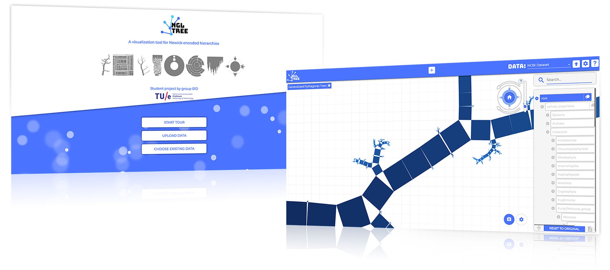
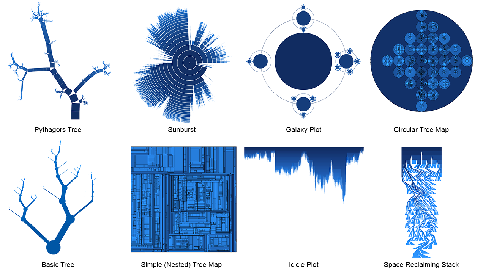

# NGL tree
This repository contains the source code for the TU/e DBL HTI + Webtech course for group 1D.
All work presented here is produced by:
- Mathijs Boezer
- Jules Cornelissen
- Roan Hofland
- Nico Klaassen
- Jordy Verhoeven
- Bart Wesselink

## Feature overview
The following features and or functionality have been implemented:
- Newick parser / uploader (with feedback)
- A total of 8 different visualizations
- High performance web-based OpenGL implementation
- Interaction through panning / zooming / rotation
- Interaction through node selections
- Tree navigator element with a search filter
- Showing multiple visualizations side by side
- Screenshot / Export of current visualization
- Dark mode
- Global settings integration for the entire tool
- Per visualization settings capabilities
- Support for color vision deficient users through color palettes
- Exploring and exporting subtrees
- Introduction tour for new users

## Visualizations
In order to support data scientists with the right tools we made a selection of 8 visualizations which we implemented. By offering a wide range of visualization styles we think our tool is suitable for visualizing many hierarchies, regardless of their structure.

## Future changes
NGL Tree is the result of a TU/e student group project. Currently the deadline for the project has passed and hence the work here can be seen as "final". There are no immediate steps we intend to take towards improving the current implementation.

## Usage tips
There is a step-by-step help feature on the front page as well as at the top right of the tool. Aditionally, Navigation in the canvas can also be done with the following hotkeys:
 - W, A, S, D : panning
 - Q, E : rotating
 - R, F : zooming
 - T : reset canvas transformations

## Live demo
A hosted version of our application can currently be found on: [dbl.mboezer.com](http://dbl.mboezer.com)

## Running the app locally
### Requirements:
- [NodeJS LTS (currently 8.11.3)](https://yarnpkg.com/en/docs/install)
- [Yarn package manager](https://nodejs.org/en/download/)

Make sure to install the Yarn package manager to your PATH to ensure smooth operation and installation of the required packages.

### Production
Build intstructions:
1. Navigate to the root directory using a terminal or command prompt.
2. Run `yarn`
3. Run `yarn build`
4. Copy the files from the `dist/` folder to a webserver and the site is good to go!

### Development
1. Navigate to the root directory using a terminal or command prompt.
2. Run `yarn`
3. Run `yarn start`
4. Navigate to `localhost:4200` to visit the site. Live-reload should automatically update your code while you're working on it.